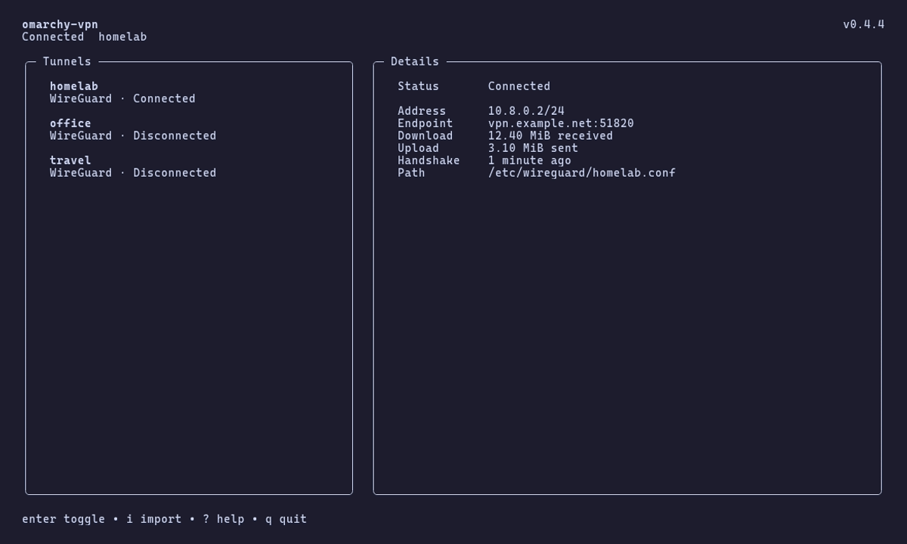
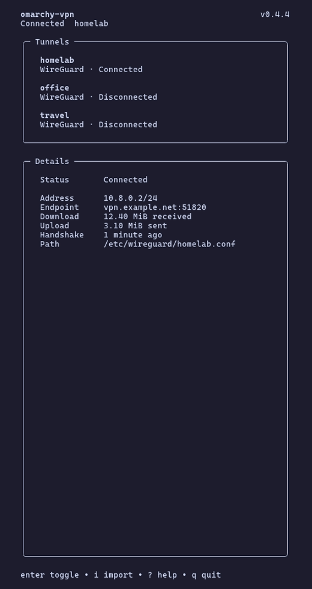

<p align="center">
  <h1 align="center">omarchy-vpn</h1>
  <p align="center">
    A blazing fast WireGuard VPN manager for your terminal.
    <br />
    Built with <a href="https://github.com/charmbracelet/bubbletea">Bubble Tea v2</a> + <a href="https://github.com/charmbracelet/lipgloss">Lip Gloss v2</a> + <a href="https://github.com/charmbracelet/bubbles">Bubbles v2</a>
  </p>
</p>

<p align="center">
  <a href="#installation"><strong>Install</strong></a> ·
  <a href="#usage"><strong>Usage</strong></a> ·
  <a href="#keybindings"><strong>Keys</strong></a> ·
  <a href="#adding-configs"><strong>Configs</strong></a>
</p>

---

<p align="center">
  
  <br />
  
</p>

## Features

- **Single-screen dashboard** — Tunnels list and Details on one screen, stacked on a narrow terminal
- **Live connection stats** — endpoint, transfer, handshake refreshing every second
- **Config preview** — highlight a config to see its details before connecting
- **Multiple tunnels** — connect to several sites at once when their AllowedIPs don't overlap; overlapping configs (e.g. two full tunnels) switch automatically
- **Inline operations** — rename and delete configs without leaving the dashboard
- **Built-in file picker** — browse and import `.conf` / `.wg` files natively
- **Follows the terminal theme** — ANSI colors, no hardcoded palette or nerd icons
- **Persistent connections** — quit the TUI, VPN stays connected
- **NetBird aware** — if NetBird is installed, toggle it from the same dashboard alongside your WireGuard tunnels
- **Bar integration** — status icon with connection details tooltip, click to launch TUI (Waybar on Omarchy 3, Omarchy shell on Omarchy 4)
- **Zero config** — passwordless via sudoers, just run `omarchy-vpn`

## Installation

### AUR

```bash
yay -S omarchy-vpn
```

Or with any AUR helper. Installs dependencies (`wireguard-tools`, `systemd-resolvconf`) and sets up sudoers automatically.

### From source

```bash
git clone https://github.com/limehawk/omarchy-vpn.git
cd omarchy-vpn
go build -o omarchy-vpn .
sudo install -Dm755 omarchy-vpn /usr/bin/omarchy-vpn
```

You'll need to manually create `/etc/sudoers.d/omarchy-vpn` — see the [PKGBUILD](PKGBUILD) for the required rules.

## Usage

```bash
omarchy-vpn
omarchy-vpn --demo   # canned tunnels only; never reads /etc/wireguard
```

That's the whole interface. Everything happens on one screen.

GIFs are recorded with VHS from `--demo` (`docs/vhs/`).

## Keybindings

### Navigation

| Key | Action |
|-----|--------|
| `j` / `↓` | Move down |
| `k` / `↑` | Move up |

### Connection

| Key | Action |
|-----|--------|
| `Enter` | Connect or disconnect the selected tunnel |

### Config Management

| Key | Action |
|-----|--------|
| `i` | Import config (opens file picker) |
| `r` | Rename selected config (inline) |
| `x` | Delete selected config (with confirmation) |

### General

| Key | Action |
|-----|--------|
| `?` | Toggle help overlay |
| `q` | Quit (VPN stays connected) |
| `Ctrl+C` | Force quit |

## Adding Configs

### Via the app

Press `i` to open the file picker. Navigate to your `.conf` or `.wg` file and select it. The config is validated, sanitized, and copied to `/etc/wireguard/`.

### Manual

```bash
sudo cp *.conf /etc/wireguard/
sudo chmod 600 /etc/wireguard/*.conf
```

## Status bar

Install adds a VPN status icon to the desktop bar. The icon shows connection state and the tooltip displays endpoint and transfer stats. Click to launch the TUI.

- **Omarchy 3** — Waybar `custom/vpn` module
- **Omarchy 4** — `limehawk.vpn` shell widget (Quickshell). Upgrading from 3 strips the old Waybar hooks and enables the new widget.
- **Neither** — setup is a no-op; the TUI still works

```bash
omarchy-vpn --setup            # Detect 3 vs 4 and install the matching bar hook
omarchy-vpn --remove           # Remove whichever hook is present
omarchy-vpn --setup-waybar     # Force the Omarchy 3 Waybar path
omarchy-vpn --remove-waybar    # Force-remove the Waybar module
```

## How It Works

omarchy-vpn is a TUI wrapper around `wg-quick` and `wg show`. Configs live in `/etc/wireguard/` as standard WireGuard `.conf` files. The app manages them with passwordless sudo via a sudoers file installed by the package.

Connect runs `wg-quick up <config>`. Disconnect runs `wg-quick down <config>`. The VPN runs in the kernel — closing the TUI doesn't affect your connection.

Multiple tunnels can be active at once. When you connect to a config, only active tunnels whose `AllowedIPs` overlap the new config's routes are brought down first — tunnels routing disjoint subnets stay connected. Two full-tunnel configs (`0.0.0.0/0`) always overlap, so connecting one switches away from the other, same as before.

## Requirements

- **Go 1.21+** (build only)
- **wireguard-tools** — `wg-quick` and `wg`
- **systemd-resolvconf** — DNS resolution for WireGuard tunnels
- A terminal with nerd font support (for icons)

## Built With

- [Bubble Tea v2](https://github.com/charmbracelet/bubbletea) — TUI framework
- [Bubbles v2](https://github.com/charmbracelet/bubbles) — Components (filepicker, help, spinner, textinput)
- [Lip Gloss v2](https://github.com/charmbracelet/lipgloss) — Terminal styling
- [Catppuccin Mocha](https://github.com/catppuccin/catppuccin) — Color palette

## License

[MIT](LICENSE)
